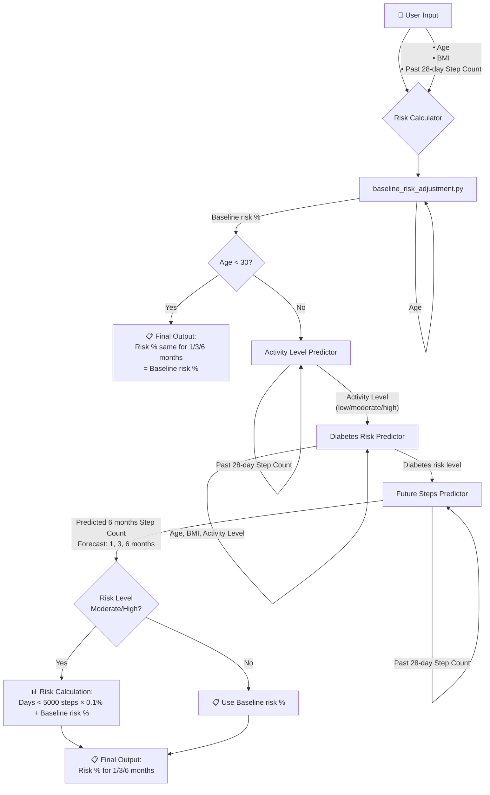

# 🩺 DiabetaLens: Forecast-Driven Diabetes Risk & Recommendation System


## 🚀 Overview

**DiabetaLens** is a predictive health analytics system that estimates and forecasts a user's diabetes risk using personal health data and activity history. Built with machine learning and enhanced by LLM integration, it provides:

- **Personalized diabetes risk predictions** for 1, 3, and 6-month horizons
- **Step-based behavior forecasting** using time series analysis
- **LLM-powered health advice & interpretation** with evidence-based recommendations
- **Retrieval-Augmented Generation (RAG)** layer for medical guideline integration

---

## 🧠 System Workflow

### 📊 Risk Calculator Pipeline



### 🤖 RAG & LLM Integration

```
Input → Risk % (1/3/6 months) + Age + Past 28-day Step Count
  ↓
[LLM with RAG]
  ↓
Output ← Personalized advice for sports by age + Step analysis
```

### 🔄 Complete Data Flow

**Primary Inputs:**
- Age
- BMI  
- Past 28-day Step Count

**Intermediate Outputs:**
- Baseline risk %
- Activity Level (low/moderate/high)
- Diabetes risk level
- Predicted 6 months Step Count

**Final Outputs:**
- Risk % for 1/3/6 months
- Personalized sports advice by age
- Step activity analysis

**Key Logic:**
- **Age < 30:** Use baseline risk % for all time periods
- **Age ≥ 30 & High/Moderate Risk:** Risk = (Days with <5000 steps × 0.1%) + Baseline risk %
- **Age ≥ 30 & Low Risk:** Use baseline risk %


---

## 🧩 Core Modules


---

## 📦 Project Structure TBC

```

```

---

## 🛠️ Installation & Setup

### Prerequisites


### Quick Start

---

## 🧪 Usage Examples
