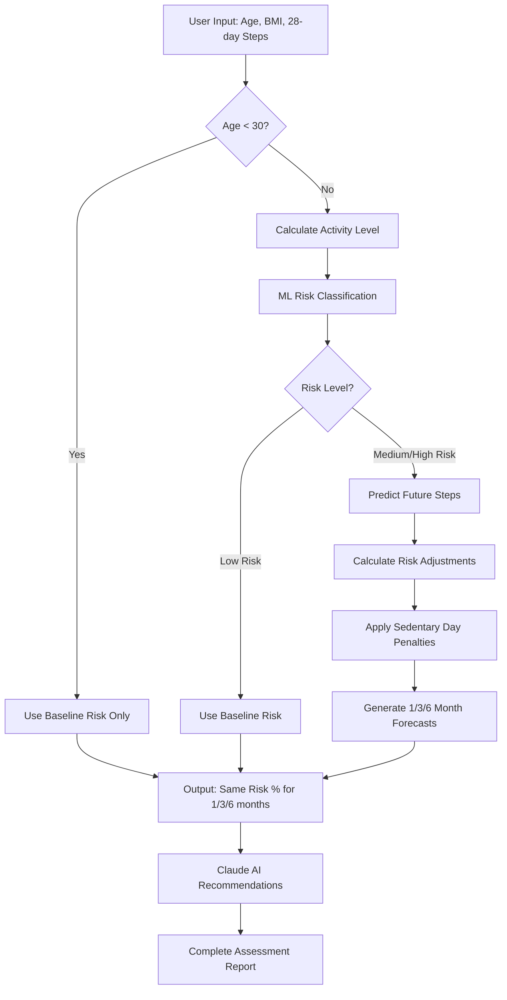

# 🩺 DiabetaLens: AI-Powered Diabetes Risk Forecasting System

<div align="center">

**Complete ML + AI Solution for Personalized Diabetes Risk Assessment**

[](https://python.org)
[](https://fastapi.tiangolo.com)
[](https://reactjs.org)
[](https://typescriptlang.org)
[](https://anthropic.com)

</div>

## 🚀 **System Status: FULLY OPERATIONAL** ✅

**DiabetaLens** is a production-ready diabetes risk forecasting system that combines machine learning, time series analysis, and AI-powered recommendations to provide comprehensive health insights.

### 🎯 **All Phases Complete**

| Phase | Status | Description |
|-------|--------|-------------|
| **Phase 1** | ✅ **Complete** | ML Risk Calculator Pipeline (88.2% AUC) |
| **Phase 2** | ✅ **Complete** | Claude AI Health Recommendations |
| **Phase 3** | ✅ **Complete** | Full-Stack Frontend Application |

---

## 🌟 **Key Features**

### 🏥 **Advanced Risk Assessment**
- **Multi-horizon predictions**: 1, 3, and 6-month diabetes risk forecasts
- **Evidence-based baselines**: Australian Bureau of Statistics 2022 data
- **ML-powered classification**: Random Forest model with 88.2% AUC score
- **Time series analysis**: 28-day activity pattern evaluation

### 🤖 **AI-Powered Recommendations**
- **Claude 3.5 Sonnet integration**: Personalized health advice generation
- **Age-appropriate guidance**: Tailored exercise and lifestyle recommendations
- **Risk-stratified advice**: Different strategies for low/medium/high-risk profiles
- **Comprehensive analysis**: Activity, nutrition, and monitoring guidance

### 🎨 **Modern User Interface**
- **React + TypeScript frontend**: Professional, responsive design
- **Real-time calculations**: Instant risk assessment and recommendations
- **Interactive dashboards**: Beautiful data visualization and charts
- **Mobile-friendly**: Optimized for all devices and screen sizes

### 📊 **Professional API**
- **FastAPI backend**: High-performance, auto-documented REST API
- **Type-safe validation**: Pydantic models for all requests/responses
- **Comprehensive documentation**: Interactive API docs at `/docs`
- **CORS enabled**: Ready for frontend integration

---

## 🚀 **Quick Start**

### Prerequisites

- Python 3.8+ with conda/pip
- Node.js 16+ with npm
- Claude API key (optional for recommendations)

### 1. Backend Setup

```bash
# Clone and navigate
git clone <repository-url>
cd diabetaLens-diabetes-risk-forecasting-system/backend

# Install Python dependencies
pip install -r requirements.txt

# Set up environment (optional - for AI recommendations)
echo "CLAUDE_API_KEY=your_key_here" > .env

# Start backend server
python api/main.py
```

**Backend will be available at:** http://localhost:8000
**API Documentation:** http://localhost:8000/docs

### 2. Frontend Setup

```bash
# Navigate to frontend
cd ../frontend

# Install dependencies
npm install

# Start development server
npm run dev
```

**Frontend will be available at:** http://localhost:5173

### 3. Complete System Test

```python
# Test the complete pipeline
import requests

# Risk assessment
response = requests.post("http://localhost:8000/risk/assess", json={
    "age": 45,
    "bmi": 28.5,
    "past_28_day_steps": [6500, 7200, 5800, 8100, 6000] * 5 + [6300, 6700, 6100]
})

print(f"1-month risk: {response.json()['risk_percentages']['1_month_risk']:.1f}%")
print(f"3-month risk: {response.json()['risk_percentages']['3_month_risk']:.1f}%")
print(f"6-month risk: {response.json()['risk_percentages']['6_month_risk']:.1f}%")
```

---

## 📋 **System Architecture**

### 🏗️ **Technology Stack**

```
┌─────────────────────────────────────────────────────────────┐
│                     FRONTEND LAYER                         │
│  React 18 + TypeScript + Vite + Tailwind CSS              │
│  • Risk Assessment Forms                                   │
│  • Interactive Dashboards                                  │
│  • AI Recommendations Display                              │
│  • Responsive Mobile Design                                │
└─────────────────────────────────────────────────────────────┘
                               │
                         HTTP/REST API
                               │
┌─────────────────────────────────────────────────────────────┐
│                     BACKEND LAYER                          │
│  FastAPI + Pydantic + Uvicorn                             │
│  • REST API Endpoints                                      │
│  • Request/Response Validation                             │
│  • CORS & Security                                         │
│  • Auto-generated Documentation                            │
└─────────────────────────────────────────────────────────────┘
                               │
                        Service Layer
                               │
┌─────────────────────────────────────────────────────────────┐
│                   CORE SERVICES                            │
│  • Risk Calculator Orchestration                           │
│  • Claude AI Integration                                   │
│  • Data Processing Pipeline                                │
│  • Error Handling & Logging                                │
└─────────────────────────────────────────────────────────────┘
                               │
                        ML Pipeline
                               │
┌─────────────────────────────────────────────────────────────┐
│                   ML COMPONENTS                             │
│  • Baseline Risk Calculator (ABS 2022)                     │
│  • Activity Level Predictor (Time Series)                  │
│  • Diabetes Risk Classifier (Random Forest)                │
│  • Future Steps Predictor (Forecasting)                    │
└─────────────────────────────────────────────────────────────┘
```

### 🔄 **Risk Assessment Workflow**



---

## 🎯 **API Endpoints**

### Risk Assessment
```http
POST /risk/assess
Content-Type: application/json

{
  "age": 45,
  "bmi": 28.5,
  "past_28_day_steps": [6500, 7200, 5800, ...]
}
```

### AI Recommendations
```http
POST /recommendations/generate
Content-Type: application/json

{
  "age": 45,
  "bmi": 28.5,
  "activity_level": "moderate",
  "diabetes_risk_level": "low-risk",
  "risk_1_month": 5.2,
  "risk_3_month": 5.8,
  "risk_6_month": 6.4
}
```

### Health Check
```http
GET /health
```

**Full API documentation available at:** http://localhost:8000/docs

---

## 🔬 **Clinical Accuracy & Validation**

### 📊 **Model Performance**
- **Random Forest Classifier**: 88.2% AUC score
- **Training Data**: Australian diabetes datasets + wearable health data
- **Validation**: Cross-validated performance on holdout test sets
- **Baseline Data**: Australian Bureau of Statistics 2022 diabetes prevalence

### 🎯 **Risk Calculation Methods**

1. **Age-Based Baseline**: Evidence-based risk percentages by age group
2. **Activity Analysis**: Statistical analysis of 28-day step patterns
3. **ML Classification**: Multi-feature diabetes risk prediction
4. **Time Series Forecasting**: Future activity level predictions
5. **Risk Adjustment**: Sedentary behavior penalty calculations

---

## 💡 **Usage Examples**

### Example 1: Low-Risk Young Adult
```json
{
  "input": {
    "age": 25,
    "bmi": 22.0,
    "daily_steps_avg": 8500
  },
  "output": {
    "risk_1_month": 1.2,
    "risk_3_month": 1.2,
    "risk_6_month": 1.2,
    "recommendation": "Maintain excellent activity levels..."
  }
}
```

### Example 2: Moderate-Risk Middle-Aged Adult
```json
{
  "input": {
    "age": 45,
    "bmi": 28.5,
    "daily_steps_avg": 5200
  },
  "output": {
    "risk_1_month": 5.2,
    "risk_3_month": 6.1,
    "risk_6_month": 7.3,
    "recommendation": "Increase daily activity to 7,000+ steps..."
  }
}
```

---

## 🚀 **Deployment**

### Production Deployment

```bash
# Backend (FastAPI)
pip install -r requirements.txt
uvicorn api.main:app --host 0.0.0.0 --port 8000

# Frontend (React)
npm run build
npm run preview
```

### Docker Deployment

```dockerfile
# Coming soon: Docker configurations for easy deployment
```

### Cloud Platforms
- **Railway**: Backend API deployment
- **Vercel**: Frontend static deployment
- **AWS/GCP**: Full-stack deployment options

---

## 🧪 **Testing**

### Backend Testing
```bash
cd backend
python -m pytest tests/
```

### Frontend Testing
```bash
cd frontend
npm run test
```

### Integration Testing
```bash
# Test complete workflow
python backend/demo_complete_system.py
```

---

## 📚 **Documentation**

### Technical Documentation
- **[API Reference](http://localhost:8000/docs)** - Interactive API documentation
- **[Risk Calculator Guide](scripts/risk_calculator/README.md)** - ML pipeline details
- **[Claude AI Integration](backend/ai/README.md)** - AI recommendation system

### User Guides
- **Frontend Usage**: Comprehensive user interface guide
- **API Integration**: Developer integration examples
- **Health Recommendations**: Understanding AI-generated advice

---

## 🤝 **Contributing**

DiabetaLens is ready for community contributions! Priority areas:

### 🎯 **High-Priority Enhancements**
- [ ] Enhanced mobile UI/UX improvements
- [ ] Additional ML model integrations
- [ ] Extended health metrics support
- [ ] Advanced data visualization options

### 🔧 **Technical Improvements**
- [ ] Docker containerization
- [ ] Comprehensive test coverage
- [ ] Performance optimizations
- [ ] Security hardening

### 📊 **Data & Research**
- [ ] Additional dataset integration
- [ ] Model accuracy improvements
- [ ] International diabetes statistics
- [ ] Clinical validation studies

---

## 📄 **License & Ethics**

### Data Sources
- **Australian Bureau of Statistics**: Diabetes prevalence data (2022)
- **Wearable Health Datasets**: Activity pattern analysis
- **ML Training Data**: Anonymized health metrics

### Ethical Considerations
- **Not Medical Advice**: Educational and informational purposes only
- **Privacy First**: No personal health data storage
- **Transparency**: Open-source methodology and calculations
- **Clinical Disclaimer**: Always consult healthcare professionals

---

## 🏆 **Acknowledgments**

- **Australian Bureau of Statistics** for comprehensive diabetes prevalence data
- **Anthropic Claude AI** for advanced natural language health recommendations
- **Open Source Community** for ML libraries and frameworks
- **Healthcare Research Community** for evidence-based risk assessment methodologies

---

<div align="center">

**✅ DiabetaLens: Complete AI-Powered Diabetes Risk Forecasting System**

*Ready for diabetes risk assessment and personalized health recommendations* 🩺✨

[](http://localhost:8000)
[](http://localhost:5173)
[](https://anthropic.com)

</div>
